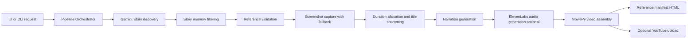
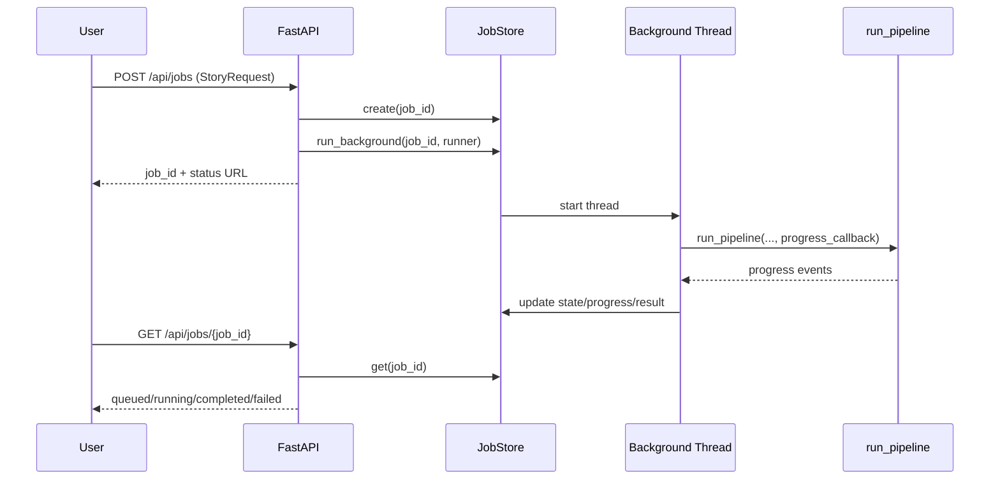
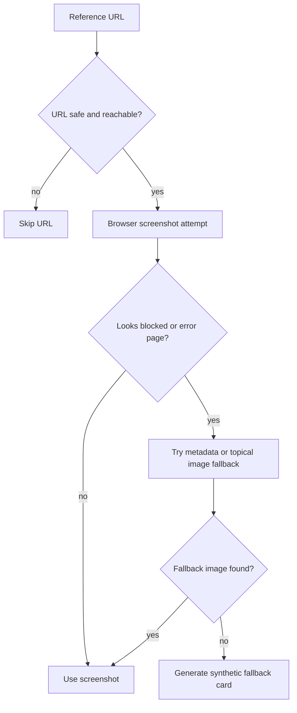
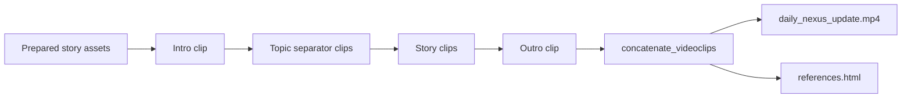
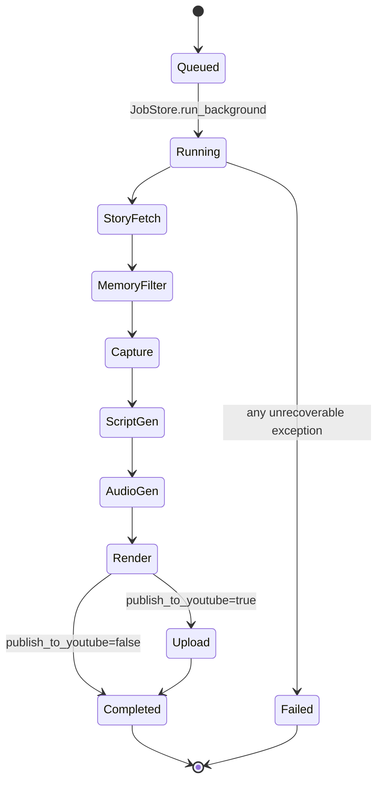

# Daily Nexus Update Pipeline Walkthrough

This guide explains how the pipeline is assembled and how data moves from story discovery to a final video (and optional YouTube upload).

Audience: Python developers who are comfortable reading application code and service integrations, but are new to this specific architecture.

## 1. Big Picture

The project is a FastAPI app with a background job pipeline. One run creates one output package under a timestamped folder.

## 2. Entry Points and Runtime Modes

There are two main ways to run the same core pipeline:

- Web mode via FastAPI.
- CLI mode via argparse.

### 2.1 Web mode

- FastAPI app starts in app/main.py.
- POST /api/jobs receives a StoryRequest.
- A random job id is created.
- JobStore starts a background worker thread.
- Worker calls run_pipeline and pushes progress updates.
- GET /api/jobs/{job_id} returns live status.

### 2.2 CLI mode

- app/cli.py builds StoryRequest from command-line args.
- It calls run_pipeline directly.
- It can also upload an already rendered file with --upload-video.

## 3. Core Data Contracts

The key models (app/models.py) shape everything:

- StoryRequest: inbound request (topics, max stories, publish_to_youtube, title suffix).
- StoryItem: one story across all stages (title, summary, references, screenshots, narration, audio, timing, memory metadata).
- PipelineResult: final pipeline output (stories, video path, youtube metadata, etc.).
- JobStatus: async job state for API polling.

Design detail that matters: StoryItem is progressively enriched. Early stages fill title/topic/summary; later stages add screenshot_paths, narration_script, audio_path, target_seconds, display_title.

## 4. Pipeline Stage by Stage

The orchestration function is run_pipeline in app/pipeline.py.

### Stage A: Initialize run context

- Load settings (pydantic-settings, .env-backed).
- Create StoryMemoryStore.
- Create a timestamped run directory under output/.
- Prepare screenshot subfolders per topic.

Result: a unique workspace for this run, for example output/2026-06-05_11-48-45/.

### Stage B: Fetch candidate stories from Gemini

- fetch_major_stories calls Gemini with a strict JSON prompt.
- Prompt includes current request topics + max story count.
- Prompt includes memory context text to discourage repeats.
- Returned JSON is parsed into StoryItem objects.

Reliability detail:
- Calls go through _call_with_retry.
- Retry is only for transient failures (429/503/timeout/high-demand style errors).
- Backoff parameters come from settings (attempts, delay, multiplier).

### Stage C: Deduplicate and classify with local memory

For each candidate story:

- StoryMemoryStore.classify_story computes a stable story_key and content_hash.
- If same key + same content hash already exists: skip as duplicate.
- If same key but changed content hash: mark as updated and keep.
- If same topic has related older entries: mark as related and keep.

Why this is useful:
- Daily videos avoid repeating the exact same story.
- Follow-ups are preserved when new information appears.

### Stage D: Resolve references and capture screenshots

For each kept story:

1. resolve_reference_resources validates up to 3 reference URLs.
2. capture_screenshot attempts a browser screenshot.
3. If blocked/consent/error pages appear, fallback logic tries image sources.
4. If all else fails, fallback card image is generated so pipeline can continue.

Outcome: every selected story gets a visual asset path, even when publisher pages are difficult to scrape.

### Stage E: Allocate durations and optimize display titles

- Story durations are computed from:
  - total time budget,
  - per-story min/max,
  - weighted importance by topic and memory status.
- Long headlines are optionally shortened with Gemini for on-screen readability.

Why weighting exists:
- updated stories and higher-priority topics can get a bit more time.
- final timeline stays under max_video_seconds.

### Stage F: Generate narration text

- build_story_narration_script generates one script per story.
- Prompt constraints enforce spoken style and complete endings.
- Greeting/opening filler is stripped for story segments.
- build_topic_transition_line generates short topic pivot lines.
- build_closing_line creates outro line.
- build_voiceover_script also assembles a full textual script record.

### Stage G: Generate audio with ElevenLabs (optional)

If ENABLE_VOICEOVER=true:

- Generate intro audio.
- Generate one audio file per story.
- Generate one transition clip per topic.
- Generate outro audio.

If disabled:

- Story audio is blank.
- Video still renders as silent visual timeline.

### Stage H: Assemble final video with MoviePy

build_video in app/services/video_builder.py performs:

- Intro card generation.
- Topic separator cards when topic changes.
- Story card creation over screenshots (headline + source label overlay).
- Audio attachment with fade in/out crossfades.
- Outro card and optional outro audio.
- Clip concatenation and MP4 export.
- references.html generation with clickable source links.

### Stage I: Optional YouTube publish

If request.publish_to_youtube=true:

- upload_video is called with title + generated description.
- Result stores youtube_video_id and youtube_url.

If false:
- Pipeline ends with local artifacts only.

## 5. End-to-End Control Flow

## 6. Files and Folders You Will Care About Most

- app/pipeline.py: orchestration and stage ordering.
- app/main.py: API surface and background job kick-off.
- app/job_store.py: in-memory async job state machine.
- app/models.py: request/result/story contracts.
- app/config.py: environment-driven settings.
- app/services/gemini_client.py: story discovery and title shortening.
- app/services/story_memory.py: repeat suppression and archival memory.
- app/services/screenshotter.py: capture + fallback strategy.
- app/services/narration.py: script generation and guardrails.
- app/services/elevenlabs_client.py: text-to-speech.
- app/services/video_builder.py: card rendering, timeline assembly, MP4 output.
- app/services/youtube_uploader.py: publish path.

## 7. Output Artifact Anatomy

Each run creates:

- output/<timestamp>/audio/
  - intro/
  - stories/
  - outro/
- output/<timestamp>/screenshots/<topic>/
- output/<timestamp>/video/
  - intro/outro/topic cards
  - references.html
  - daily_nexus_update.mp4

This structure makes post-run debugging easy:

- visual issue -> inspect screenshots and generated card images.
- narration issue -> inspect story scripts and audio files.
- timeline issue -> inspect durations and clip/audio lengths.

## 8. Operational Concepts Used in This Codebase

### Exponential backoff
Retry waits increase after failures (or stay constant if multiplier is 1.0). Helps avoid hammering busy APIs.

### Idempotent-ish reruns
A run creates a new output folder and updates memory, so reruns do not overwrite prior artifacts and are easy to compare.

### TLS trust store
The set of root certificates your environment trusts. If customized incorrectly, HTTPS calls to providers can fail. The app includes a TLS guard to warn early.

### OAuth token caching
YouTube upload uses OAuth desktop flow once, then reuses a saved token file to avoid re-consenting every run.

### Crossfade
Audio effect where one segment fades out while the next fades in, reducing harsh transitions.

### Fallback rendering
When primary capture fails (anti-bot, consent pages, errors), the pipeline degrades gracefully to fallback images/cards rather than failing the full run.

## 9. How Components Are Tied Together

Think in terms of dependency direction:

- Pipeline orchestrator depends on service modules.
- Service modules are mostly stateless functions, fed by Settings + StoryItem data.
- StoryItem is the shared carrier object between stages.
- JobStore wraps orchestrator execution for async API usage.

This gives a practical architecture split:

- Control plane: FastAPI + JobStore + pipeline orchestration.
- Data plane: story records and memory files.
- Media plane: screenshot + narration + audio + video assembly.
- Distribution plane: optional YouTube upload.

## 10. Practical Reading Order (for New Contributors)

1. app/models.py
2. app/config.py
3. app/pipeline.py
4. app/services/story_memory.py
5. app/services/screenshotter.py
6. app/services/narration.py
7. app/services/video_builder.py
8. app/main.py and app/job_store.py

If you follow that order, most implementation decisions in this repository become straightforward.
